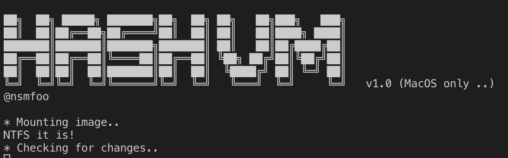

# hashvm

Detect which files have been changed and/or added to a VBox image. Poor man's sandbox.

This is a re-make of an old script I created a "while" back:  <https://blog.prowling.nu/2012/10/detect-changes-in-virtual-guest-after.html>

This version is somewhat improved, but also a bit more limited in usability as there is only support for MacOS.

Syntax:

sudo hashvm.sh -i image_name (inkl path) -m mount_dir -a <check|update> (optional) -e exclude regexp(ex: '^\/Users\/')

ex:

sudo sh hashvm.sh -i /Users/Bilbo/VirtualBox\ VMs/windows7/W7-disk1.vdi -m /mnt/ -a check

sudo sh hashvm.sh -i /Users/Bilbo/VirtualBox\ VMs/windows7/W7-disk1.vdi -m /mnt/ -a check -e '^\/Documents and Settings\/|^\/Program Files\/|^\/ProgramData\/|^\/Users\/'

sudo sh hashvm.sh -i /Users/Bilbo/VirtualBox\ VMs/windows7/W7-disk1.vdi -m /mnt/ -a update
